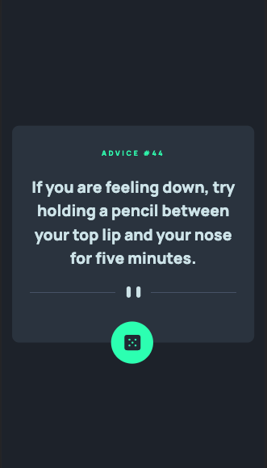
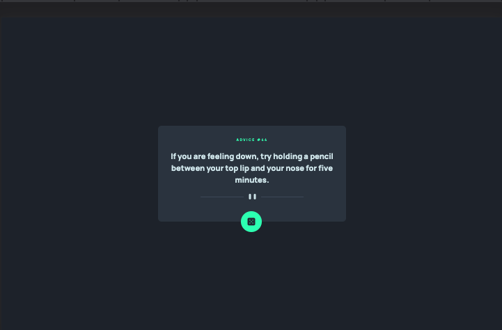

# Frontend Mentor - Advice generator app solution

This is a solution to the [Advice generator app challenge on Frontend Mentor](https://www.frontendmentor.io/challenges/advice-generator-app-QdUG-13db). Frontend Mentor challenges help you improve your coding skills by building realistic projects.

## Table of contents

- [Overview](#overview)
  - [Screenshot](#screenshot)
  - [Links](#links)
- [My process](#my-process)
  - [Built with](#built-with)
  - [What I learned](#what-i-learned)
  - [Continued development](#continued-development)
  - [Useful resources](#useful-resources)
- [Author](#author)

## Overview

### Screenshot

### Links

- Solution URL: [Add solution URL here](https://your-solution-url.com)
- Live Site URL: 

## My process

### Built with

- Mobile-first workflow
- JavaScript
- CSS custom properties
- CSS Style Resets
- Flexbox
- BEM 

### What I learned

For this project I just learned the importance or double checking your code and also makeing sure the class and id names and logical.
Also for assigning variables from the DOM to use id to target specific elements.

### Continued development

This challenge for me was just a way for me to continue to understand API better
and how I can use and manipulate the data. For my next project I want to use RapidApi.

### Useful resources

- [Understanding Rest API](https://www.smashingmagazine.com/2018/01/understanding-using-rest-api/?ck_subscriber_id=1454331011)
- [Fetch API](https://developer.mozilla.org/en-US/docs/Web/API/Fetch_API/Using_Fetch)

## Author

- Website - [Kenneth](https://www.mrdebonairfox.com)
- Frontend Mentor - [@kbrandon19](https://www.frontendmentor.io/profile/kbrandon19)
- Twitter - [@mrdebonairfox](https://www.twitter.com/mrdebonairfox)
- GitHub - [@kbrandon19](https://www.github.com/kbrandon19)